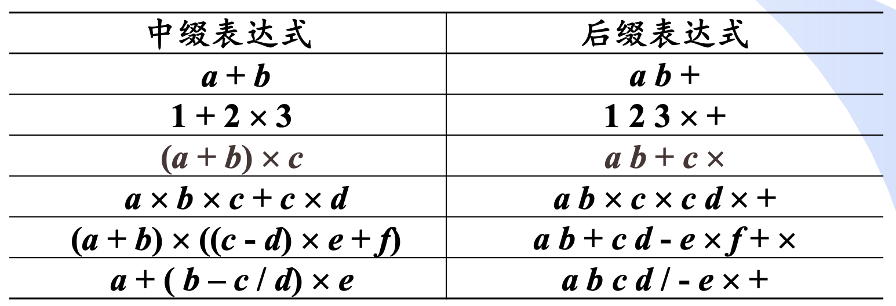
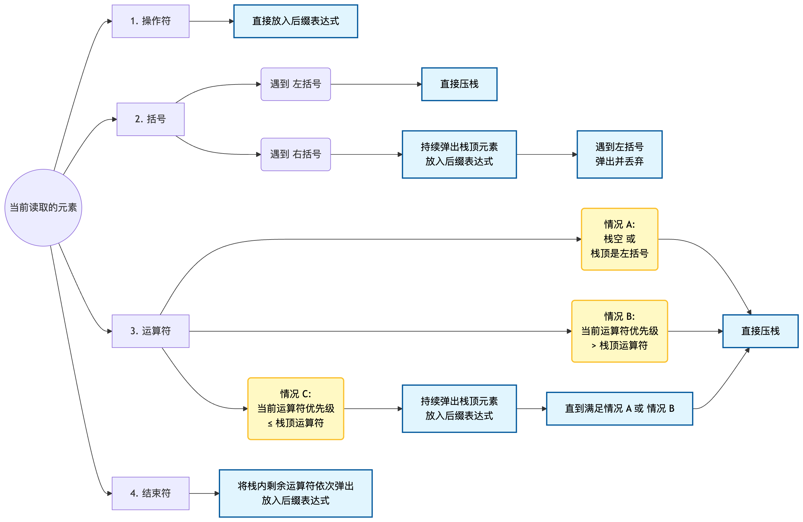
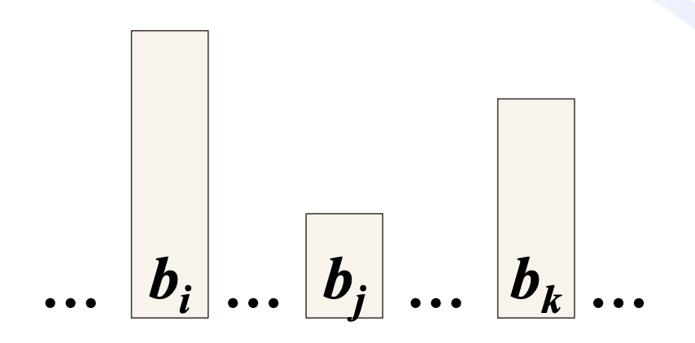
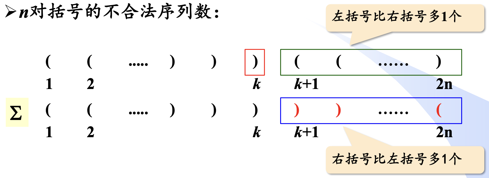
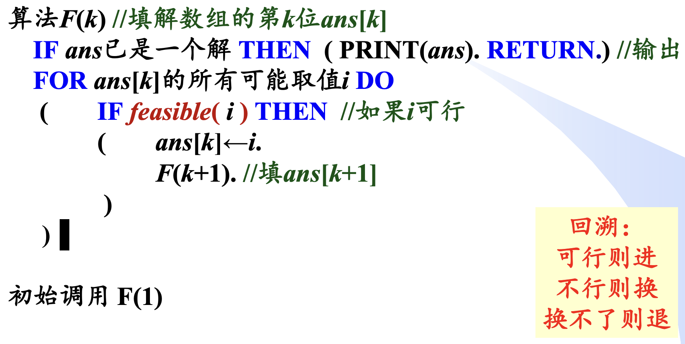

import InfixToPostfixDemo from "../../components/blog/leetcode/InfixToPostfixDemo.astro";

## 栈及其应用

> Lecture 05
>
> 这份课件也是以大量题目为主。

### 括号匹配

https://leetcode.cn/problems/valid-parentheses/description/

力扣是一道偏基础的题目，主要考察重点是 `if-else` 的覆盖。

https://www.acwing.com/problem/content/3706/

AcWing 上的这道题会考察的更全面，需要作优先级判断。

```cpp
#include <iostream>
#include <stack>
#include <unordered_map>
#include <string>

using namespace std;

unordered_map<char, char> pairs = {{'(', ')'}, {'[', ']'}, {'{', '}'}, {'<', '>'}};
unordered_map<char, int> prior = {{'{', 4}, {'[', 3}, {'(', 2}, {'<', 1}};

bool check (const string& s) {
    stack<char> S;
    for (const auto& c : s) {
        if (prior.count(c)) {
            if (!S.empty()) {
                if (prior[c] > prior[S.top()]) return false;
            }
            S.push(c);
        }
        else if (c == '>' || c == ')' || c == ']' || c == '}') {
            if (S.empty() || pairs[S.top()] != c) return false;
            S.pop();
        }
    }
    return S.empty();
}

int main () {
    int n;
    if (!(cin >> n)) return 0;
    while (n--) {
        string s;
        cin >> s;
        if (check(s)) cout << "YES" << endl;
        else cout << "NO" << endl;
    }
    return 0;
}
```

### 括号生成

https://leetcode.cn/problems/generate-parentheses/description/

这道题其实考察的是回溯问题，我放在这是因为老师的PPT里有留下这道思考题，没有要求枚举出全部情况，但是希望我们计算出满足条件的情况数。

这是很经典的**卡特兰数**问题，这里作一个简单的解读，更详细的计算过程在下文的[具体计算](https://passpot.cn/blog/sjjg-02/#栈混洗总数---卡特兰数)。

$$
C_n = \frac{1}{n+1} \binom{2n}{n} = \frac{(2n)!}{(n+1)!n!}
$$

拆解题目，可以看作是：在左右括号总数相等的前提下，从左往右扫描，任意时刻已出现的左括号数量必须大于或等于已出现的右括号数量。

这样就可以对上经典的坐标系问题：从 $(0,0)$ 点走到 $(n,n)$ 点，且路径不能越过直线 $y=x$ 的方案数。

也可以在括号总数为 $n$ 时把情形拆解为左区括号数为 $i$；右区括号数为 $n-i$的数学形式：

$$
C_{n+1} = \sum_{i=0}^{n} C_i C_{n-i}
$$

这正好是**卡特兰数**的递推式。

## 算术表达式求值

在做这类题之前，必须要先对算术表达式的构成有一个清晰的认识，主要包括：

1. **操作数**：常量或变量。
2. **运算符**：算术运算符，如 `+`、`-`、`*`、`/` 等。
3. **界限符**：如括号 `(` 和 `)`，用于改变运算优先级。

### 中缀/后缀表达式

我在这里给出一个标准的算术表达式：

$$
(a + b \times c) / d - e
$$

这个表达式的优点显而易见：符合人类的阅读习惯，清晰易读。我们称之为**中缀表达式**。

但这类表达式的缺点也很明显，对计算机解析不友好 —— 我们人类一眼能辨析的优先级和闭合关系，在计算机看来非常模糊。

因此我们需要一种更适合计算机处理的表达式形式，即**后缀表达式**。

后缀表达式又称**逆波兰表达式**，是一种运算符紧跟在运算对象之后的表达式，其优点：

1. 没有括号
2. 不存在优先级的差别
3. 计算过程完全按照运算符出现的先后次序进行



计算机在处理后缀表达式时就简单粗暴了：

1. 从左到右扫描表达式
2. 遇到操作数就压入栈中
3. 遇到运算符就弹出栈顶的两个操作数进行运算，并将结果压回栈中
4. 最后栈顶的元素就是表达式的值

所以算术表达式求值本质是两大步骤：把中缀表达式转换成后缀表达式；计算后缀表达式的值。

### 中缀转后缀

<InfixToPostfixDemo />

#### 调度场算法

调度场算法是一种通过使用**运算符栈**将中缀表达式转为后缀表达式的算法。

该算法最大的难点在于多种判断逻辑的记忆。



记住所有情况后，具体的代码实现倒是不难，只要维护 `stack<char> S` 和 `string postfix` 两个数据结构就行了。

```cpp
string infixToPostfix(const string& infix) {
    stack<char> S;
    string postfix = "";
    unordered_map<char, int> prior = {{'+', 1}, {'-', 1}, {'*', 2}, {'/', 2}};
    for (const auto& c : infix) {
        if (isalnum(c)) { // 操作数
            postfix += c;
        }
        else if (c == '(') {
            S.push(c);
        }
        else if (c == ')') {
            while (!S.empty() && S.top() != '(') {
                postfix += S.top();
                S.pop();
            }
            if (!S.empty()) S.pop(); // 弹出 '('
        }
        else { // 运算符
            while (!S.empty() && prior[S.top()] >= prior[c]) {
                postfix += S.top();
                S.pop();
            }
            S.push(c);
        }
    }
    while (!S.empty()) {
        postfix += S.top();
        S.pop();
    }
    return postfix;
}
```

### 表达式求值

有两种方案：

- 在完全转成后缀表达式后，按顺序扫描，每遇到一个运算符就取出两个操作数进行运算。
- 在中缀转后缀时直接运算：在需要把运算符放入后缀时直接取出操作数运算。这种情况下并不会产出一个完整的后缀表达式，但正因为其动态性，我们大可以用一个栈来维护。

显而易见是方案二更高效，所以这里只给出方案二的代码实现：

```cpp
int calculate(string s) {
    stack<int> NUM;  //操作数栈
    stack<char> OP;  //运算符栈
    unordered_map<char, int> prior = {{'+', 1}, {'-', 1}, {'*', 2}, {'/', 2}}; // 运算符优先级
    int n = s.size();
    for (int i = 0; i < n; i++) {
        char c = s[i];
        if (c >= '0' && c <= '9') { // 读入多位数值
            NUM.push(readnum(s, n, i));
        }
        else if (c == '(') {
            OP.push(c);
        }
        else if (c == ')') {
            while (OP.top() != '(') {
                operation(NUM, OP);
            }
            OP.pop(); // 弹出 '('
        }
        else { // 遇到 + - * /
            while (!OP.empty() && OP.top() != '(' && prior[c] <= prior[OP.top()]) {
                operation(NUM, OP);
            }
            OP.push(c);
        }
    }
    while (!OP.empty()) {
        operation(NUM, OP);
    }
    return NUM.top();
}
```

需要注意，这段代码中 `readnum` 和 `operation` 是两个辅助函数，分别用于读取多位数值和执行运算。

而且正是因为 `readnum` 需要调整索引位置，不得不舍弃 `for (const auto& c : s)` 的写法，回归最基础的遍历。

```cpp
int readnum(const string& s, int n, int& i) {
    int num = 0;
    while (i < n && s[i] >= '0' && s[i] <= '9') {
        num = num * 10 + (s[i] - '0');
        i++;
    }
    i--; // 调整索引位置
    return num;
}
```

## 栈混洗

### 何为栈混洗

**栈混洗**是指给定一个栈的输入序列，需要逐个压入栈中，可以选择在任意时刻弹出栈顶元素。当输入序列全部经历一次入栈和出栈后，对最后的**输出序列**作讨论。

因为栈中的决策对外界的我们来说是一个黑箱，所以在我们的视角看来，这些元素就像是经历了一场**混洗**后组成一个新的序列。

### 栈混洗的合法性

https://leetcode.cn/problems/validate-stack-sequences/description/

#### 题目分析

思路还是很明确的，两个序列强收敛了可能性，类似构建合法树。

可以记住 `return s.empty()` 这个比较巧妙的写法。

#### 代码实现

```cpp
bool validateStackSequences(vector<int>& pushed, vector<int>& popped) {
    int i = 0;
    stack<int> s;
    for (const auto& t : pushed) {
        s.push(t);
        while (!s.empty() && s.top() == popped[i]) {
            s.pop();
            i++;
        }
    }
    return s.empty();
}
```

### 栈混洗的甄别 - 312 模式

若入栈序列为 $1, 2, … , n$，对于出栈序列中 $1 \le i < j < k \le n$ 位置的 $3$ 个元素，如果 $b_i > b_k > b_j$，则必为非法出栈序列。



还是比较容易想明白的：两个元素（$b_j$, $b_k$）之间如果想错位出栈（即小数先出，大数后出），则必须让小数在大数入栈前弹出。但引入第三者（$b_i$）后，$b_i$ 和 $b_j$ 之间的顺序出栈又代表着在 $b_i$ 入栈前 $b_j$ 不能弹出，于是矛盾。

### 栈混洗总数 - 卡特兰数

#### 问题转化

在统计栈混洗的序列总数之前，需要把前置条件列举清楚：

- 对 $n$ 个元素进行讨论。
- 合法性的前提是：在任意时刻，**已弹出**的元素数量不能超过**已压入**的元素数量。

而我们在之前学习的**括号匹配**也有类似的两大条件：

- 对 $n$ 对括号进行讨论。
- 合法性的前提是：在任意时刻，**已出现的左括号**数量不能小于**已出现的右括号**数量。

由此，我们可以把入栈和出栈两个**对立操作**抽象看作是左括号和右括号的关系。

若想栈混洗序列合法，则每一个元素都需要经历一次入栈和一次出栈操作，正对应了每一对括号都有一左一右两个。

即每次的元素入栈都是一次左括号的出现，每次的元素出栈都是一次右括号的出现。

那么**栈混洗的合法序列总数**就等价于**括号匹配的合法序列总数**，也就是**卡特兰数**。

#### 具体计算

现在开始讨论 $n$ 对括号下**括号匹配的合法序列总数**。

我们的思路是：**合法序列数 = 总数 - 非法序列数**。

总共 $n$ 个 `'('` 和 $n$ 个 `')'` 任意排列，**总数**为 **$C_{2n}^{n}$**。

而**非法序列**的定义是：在某个时刻，已出现的右括号数量超过了已出现的左括号数量。



我们观察给定的一个非法序列，令其第 $1$ 个匹配失败的位置为 $k$，对 $k$ 之后的序列**取反**，即左右括号互换。此时得到一个新序列 $\sum$。

分析原来的非法序列：

- 在 $k$ 位置，`')'` 的数量比 `'('` 的数量多 $1$。
- 则在 $k$ 之后，`'('` 的数量比 `')'` 的数量多 $1$。

那取反后的序列 $\sum$：

- 在 $k$ 位置，仍然是 `')'` 的数量比 `'('` 的数量多 $1$。
- 而在 $k$ 之后，则是 `')'` 的数量比 `'('` 的数量多 $1$。

因此 $\sum$ 中 `')'` 的数量为 $n+1$，而 `'('` 的数量为 $n-1$。

以此，我们得到了对应关系：$\sum$ 序列可以唯一对应一个非法序列。

因此，**非法序列数**为 **$C_{2n}^{n-1}$**。

综上，**合法序列数**为：

$$
\begin{aligned}
C_{2n}^{n} - C_{2n}^{n-1} &= \frac{(2n)!}{n!\,n!} - \frac{(2n)!}{(n-1)!\,(n+1)!} \\
&= \frac{(2n)!\,(n+1)}{n!\,(n+1)!} - \frac{(2n)!\,n}{n!\,(n+1)!} = \frac{(2n)!}{n!\,(n+1)!} \\
\text{Catalan}(n) &= \frac{1}{n+1}C_{2n}^{n}
\end{aligned}
$$

## 递归与回溯

### 递归

每一次递归调用都会在系统栈中产生一个栈帧，故递归函数的空间复杂度依赖于递归深度。若递归过深，有系统栈溢出的风险。



### n 皇后问题

这是一道回溯问题。

https://leetcode.cn/problems/n-queens/description/

```cpp
class Solution {
public:
    vector<vector<string>> ans;

    void dfs(int n, int row, vector<string>& B, vector<bool>& R, vector<bool>& C) {
        if (row == n) {
            ans.push_back(B);
            return;
        }
        for (int col = 0; col < n; col++) {
            if (!R[row] && !C[col] && isValid(n, row, col, B)) {
                B[row][col] = 'Q';
                R[row] = true;
                C[col] = true;
                dfs(n, row + 1, B, R, C);
                B[row][col] = '.';
                R[row] = false;
                C[col] = false;
            }
        }
    }

    bool isValid(int n, int row, int col, vector<string>& B) {
        for (int i = row - 1, j = col - 1; i >= 0 && j >= 0; i--, j--) {
            if (B[i][j] == 'Q') return false;
        }
        for (int i = row - 1, j = col + 1; i >= 0 && j < n; i--, j++) {
            if (B[i][j] == 'Q') return false;
        }
        return true;
    }

    vector<vector<string>> solveNQueens(int n) {
        vector<string> board(n, string(n, '.'));
        vector<bool> row(n, false);
        vector<bool> col(n, false);
        dfs(n, 0, board, row, col);
        return ans;
    }
};
```

### 快速幂

这是一道递归问题。

https://leetcode.cn/problems/powx-n/

```cpp
class Solution {
public:
    double myPow(double x, int n) {
        long long N = n;
        if (n < 0) {
            x = 1 / x;
            N = 0 - N;
        }
        return cal(x, N);
    }

private:
    double cal(double x, long long n) {
        if (n == 0) {
            return 1.0;
        }
        double half = cal(x, n / 2);
        if (n % 2 == 0) {
            return half * half;
        }
        else {
            return half * half * x;
        }
    }
};
```
