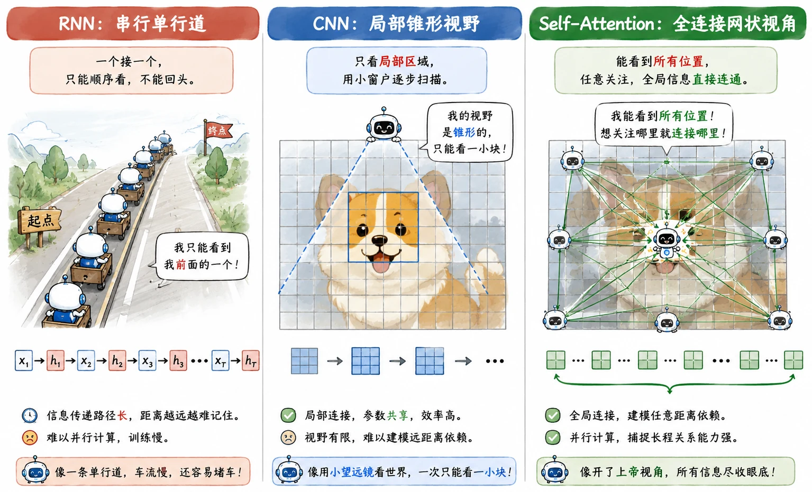
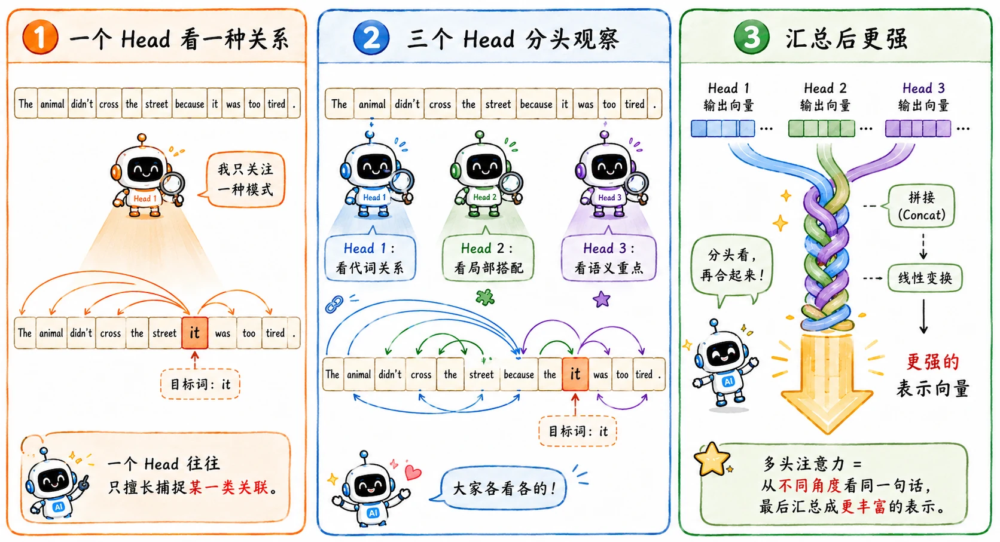

> 相比 RNN 在单行道上排队传递情报，Transformer 直接在广场上拉起了一张全连接的无死角通讯网。
>
> 加速，加速，加速！

## 天下武功，唯快不破

RNN 的硬伤已经是老生常谈了，串行计算效率低下，就算在工程中提出了[并行策略](/blog/rnn-04-lstm/#从单一细胞到向量化层)，但根本的**数据依赖**没有解决。

要算 $h_2$，就必须老老实实等 $h_1$ 算完；要算 $h_3$，又得等 $h_2$。这对 GPU 来说，完全折磨。

中间也有人尝试过用 CNN 来处理文本。卷积的好处是能大面积并行，抓取局部短语特征也很拿手。但语言存在**长距离依赖（Long-term Dependency）**，CNN 受限于局部的感受野，想要让句子首尾的词建立联系，就必须堆叠极深的网络层数。信息在层层传递中，早就发生了损耗。

就在这个关键时刻，**Self-Attention（自注意力机制）** 登场了。它带来了一个降维打击—— **$O(1)$ 的路径长度**：

> 句子里的每一个词，在同一层里，直接跨越空间限制，和全场所有的词进行全连接交流。

## QKV

### 什么是 QKV？

Self-Attention 的核心引擎由三个向量驱动：

- **Query (Q)：** 我要找什么。
- **Key (K)：** 每条内容的索引标签。
- **Value (V)：** 每条内容真正携带的信息。

这套逻辑其实就是现代数据库检索系统的翻版。会有疑问，既然是 Self-Attention，为什么不直接拿词向量 $X$ 互相点积？

答案在于**打破对称性**并**引入可学习参数**。直接用同一表示做匹配会限制表达能力，Q/K/V 分离让“查询角色”“被检索角色”和“内容载体”可以分别学习。

因此，我们引入了三个不同的权重矩阵 $W^Q, W^K, W^V$，把同一个输入 $X$ 投影到三个不同的特征空间中：

$$
Q = XW^Q,\quad K = XW^K,\quad V = XW^V
$$

最后我们终于得到了那个印在深度学习教科书首页的终极公式：

$$
\text{Attention}(Q,K,V) = \text{softmax}\left(\frac{QK^T}{\sqrt{d_k}}\right)V
$$

### 数学推导

假设句子有 4 个词（$T=4$），单头注意力维度 $d_k=64$。

1. **$QK^\top$：计算两两匹配相似度**

   $Q=[T, d_k]=[4, 64]$

   $$
   \begin{bmatrix}
   q_1^{(1)} & q_1^{(2)} & \dots & q_1^{(64)} \\
   q_2^{(1)} & q_2^{(2)} & \dots & q_2^{(64)} \\
   q_3^{(1)} & q_3^{(2)} & \dots & q_3^{(64)} \\
   q_4^{(1)} & q_4^{(2)} & \dots & q_4^{(64)} \\
   \end{bmatrix}
   $$
   - 第 1 行：第 1 个词的完整查询向量 $\boldsymbol{q}_1 \in \mathbb{R}^{d_k}$，共 64 个元素
   - 第 2 行：第 2 个词的查询向量 $\boldsymbol{q}_2 \in \mathbb{R}^{d_k}$
   - ……

   $K^\top=[d_k, T]=[64,4]$：

   $$
   \begin{bmatrix}
   k_1^{(1)} & k_2^{(1)} & k_3^{(1)} & k_4^{(1)} \\
   k_1^{(2)} & k_2^{(2)} & k_3^{(2)} & k_4^{(2)} \\
   \vdots & \vdots & \vdots & \vdots \\
   k_1^{(64)} & k_2^{(64)} & k_3^{(64)} & k_4^{(64)}
   \end{bmatrix}
   $$

   **矩阵相乘 $QK^\top$ 输出相似度分数矩阵**，尺寸 $[T, T]$

   $$
   \underbrace{
   \begin{bmatrix}
   s_{1,1} & s_{1,2} & s_{1,3} & s_{1,4} \\
   s_{2,1} & s_{2,2} & s_{2,3} & s_{2,4} \\
   s_{3,1} & s_{3,2} & s_{3,3} & s_{3,4} \\
   s_{4,1} & s_{4,2} & s_{4,3} & s_{4,4}
   \end{bmatrix}
   }_{S=QK^\top,\quad \text{shape } [4,4]}
   $$

   $(i,j)$：**第 $i$ 个查询 token $q_i$，和第 $j$ 个键 token $k_j$ 的匹配程度**。

2. **$\sqrt{d_k}$：缩放操作**

   可以压缩点积的数值波动范围；在独立同分布假设下，点积方差约为 $d_k$，缩放后方差回到约 $1$，使得 Softmax 输出的权重分布更均匀，全程保留可更新的梯度。

3. **$\text{softmax}(\cdot)$：归一化**

   对相似度矩阵**每一行单独做 softmax**，保证每行权重加和为 $1$，得到**注意力权重矩阵 $\alpha$**：

   $$
   \begin{bmatrix}
   \alpha_{11} & \alpha_{12} & \alpha_{13} & \alpha_{14} \\
   \alpha_{21} & \alpha_{22} & \alpha_{23} & \alpha_{24} \\
   \alpha_{31} & \alpha_{32} & \alpha_{33} & \alpha_{34} \\
   \alpha_{41} & \alpha_{42} & \alpha_{43} & \alpha_{44}
   \end{bmatrix}
   $$

   $$
   \alpha_{i,j} = \text{softmax}\left(\frac{q_i k_j^\top}{\sqrt{d_k}}\right)
   $$

   $\alpha_{i,j}$：解码/编码第 $i$ 个词时，分配给第 $j$ 个输入 token 的关注权重。

4. **$V$：加权求和**

   权重矩阵 $\alpha$ 乘以值矩阵 $V \in [T,d_k]$：

   $$
   \text{Attention}(Q,K,V) = \alpha V
   $$

   取第 $2$ 行看：

   $$
   [\alpha_{21},\ \alpha_{22},\ \alpha_{23},\ \alpha_{24}]
   $$

   代表第 $2$ 个词，分配给 $4$ 个词的关注度权重。

   计算输出向量：

   $$
   \text{output}_2 = \alpha_{21}\boldsymbol{v}_1 + \alpha_{22}\boldsymbol{v}_2 + \alpha_{23}\boldsymbol{v}_3 + \alpha_{24}\boldsymbol{v}_4
   $$

   对应通用公式：

   $$
   \text{output}_i = \sum_{j=1}^T \alpha_{i,j} \cdot v_j = c_i
   $$

   即对所有 $v_j$ 按注意力加权求和，生成只属于第 $i$ 个 token 的专属上下文向量。

### 实例演示

我们拿一句大白话来看看：

> 这 部 电影 很 好看

模型算到“好看”时，它的 Query 会去全场扫射：

- 匹配“这”，分数极低；
- 匹配“部”，分数极低；
- 匹配“电影”，Bingo！分数飙高。

于是，“电影”这个词携带的 Value，就会被赋予极大的权重，像调色一样被融进“好看”的新表示里。经过这一层，原本干瘪的“好看”，就变成了一个富含上下文的“修饰电影的好看”。

**而且这套规则完全不需要人工干预。**

用来做乘法的 $W^Q, W^K, W^V$ 矩阵，全都是模型自己在成百上千亿的语料库里“炼”出来的。它会自己学会到底该关注语法搭配，还是关注情感修饰。

## 矩阵并行化

Self-Attention 真正改变深度学习时代的命门，在于它可以是**纯粹的矩阵运算**，一切都被打包成了超级大的矩阵乘法：

1. $X \times W$，算出全场所有词的 $Q, K, V$。
2. $Q \times K^T$，得到所有词两两之间的 Attention 棋盘。
3. 再乘上 $V$，完成所有权重的加权融合。

这是 Transformer 能吃下海量参数、海量数据，并最终引爆 LLM 狂潮的硬件底座。

## Multi-Head

单 Attention 头是有局限的，它只能在某一种特定的**情感/语义空间**里去做匹配。

同样是“电影”和“好看”，在一个维度里它们是主谓关系；在另一个维度里可能都是属于“娱乐”范畴的词。

**Multi-Head Attention（多头注意力）** 同时维护几组完全独立的 QKV 投影矩阵，每个 Head 各自算完之后，大家把结果拼在一起（Concat），最后再过一个线性层（Linear）整合。

## 位置编码

Self-Attention 这么神，但有一个硬伤：**本质是不辨方向的词袋**。

如果只把词丢进那个 QKV 的公式里互换眼神，那对模型来说，“我喜欢你”和“你喜欢我”是完全等价的，因为参与打分的 Token 一模一样。

为了不让网络变成文盲，Transformer 被迫引入了一个外挂装置：**Positional Encoding（位置编码）**。

在单词变成 Embedding 送进网络之前，原论文硬是用正弦和余弦函数，给每一个词都带上了一串代表**绝对位置或相对位置**的坐标向量。

这样模型才终于拥有了位置信息。

_(注：Jay Alammar 的 [The Illustrated Transformer](https://jalammar.github.io/illustrated-transformer/) 做了很好的可视化，可以学习关于 QKV 和位置编码的动画演示。)_
