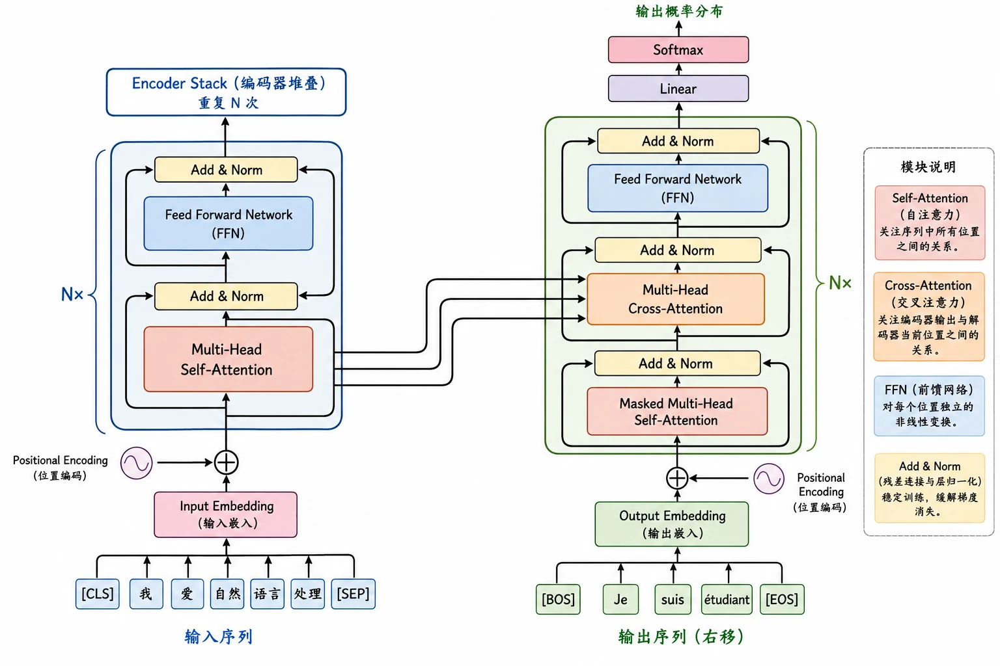
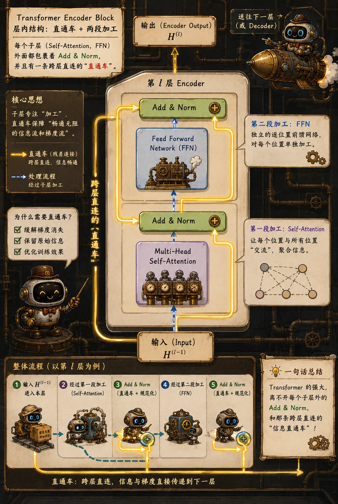

> 终于进入重头戏：Transformer 架构。

## 整体结构

原始的 Transformer 没有脱离经典的 Seq2Seq 框架。

依旧是 Encoder-Decoder，只不过 RNN 循环单元，被替换成了由 Attention 堆叠而成的模块。

- **Encoder 负责读**： 它一次性吞下所有的输入序列，通过层层网络，将每一个词都提炼成包含全局上下文的稠密向量。建立对当前信息的**深度理解**。

- **Decoder 负责写**： 它是一个自回归生成器，负责根据已经生成的词，并且不断“回头看” Encoder 提取的精华，来逐字吐出最终的输出。

可以看 [The Illustrated Transformer](https://jalammar.github.io/illustrated-transformer/) 来学习完整结构。

## Encoder Block

一个标准的 Encoder block 由两个核心子层构成，都是我们的老朋友了：

1. **Multi-Head Self-Attention（多头自注意力机制）**
2. **Feed Forward Network（前馈神经网络）**

如果只用 Attention 会怎样？Attention 本质上在做信息的**加权路由和混合**。它让当前 Token 收集到了全场的线索，但本身只是一次线性变换的组合。

这就是 FFN 存在的意义。FFN 通常是两层全连接层，中间带一个 ReLU/GELU 这样的激活函数。它通常会把维度放大 4 倍然后再缩小（例如 $512 \to 2048 \to 512$）。这个过程为网络提供了**巨大的参数空间和非线性表达能力**。

**关键**： FFN 是对每一个 Token 的位置**独立**应用的，即分别单独加工「融合了上下文的 “我”」、「融合了上下文的 “吃”」、「融合了上下文的 “苹果”」。

## Add & Norm

仔细看 Transformer 的架构图，会发现每个 Attention 和 FFN 的外层，都套着这个神秘结构。

Add 指的是**残差连接**：

$$
x_{out} = x + \text{Sublayer}(x)
$$

这是 [ResNet](/blog/cnn-05-resnet/) 思想的一脉相承，把输入 $x$ 直接绕过子层加到输出上，具体就不再赘述了。

Norm 指的是**层归一化**：

NLP 数据不像 CV 数据那样有着固定的形状（比如 $256 \times 256$ 的图片），句子的长度是动态的。如果用 Batch Norm，不同句子长度带来的 padding 会让均值和方差产生严重抖动。Layer Norm 则是在特征维度上做归一化。它将每个词的特征向量拉回均值为 0、方差为 1 的稳定分布，确保数据尺度不会在深层网络中爆炸或干涸，极大地加速了训练收敛。[具体的对比](/blog/dl-10-training-stability-tricks/#normalization)在之前的文章有介绍。

## Decoder 的 Mask

Decoder 的结构大致和 Encoder 相似，但它多了一个物理约束：

> 在预测第 $t$ 个 token 时，不能让它提前看到第 $t+1$ 个 token 及之后的任何信息。

这是遵从自回归生成的铁律：时间只能单向流淌。

在实际训练中，为了发挥 GPU 矩阵并行的优势，我们通常会一次性把整句目标答案（Ground Truth）喂给 Decoder。如果不加干预，Self-Attention 的“上帝视角”会让模型瞬间瞥见后面的正确答案，把“预测”变成“作弊”。

为了防止数据泄露，Decoder 的第一层被替换成了 **Masked Multi-Head Attention**。

在计算 Attention Score 的矩阵时，模型会人为地加上一个**下三角掩码（Causal Mask）**。它将当前词对未来词的注意力得分强行设为负无穷大（$-\infty$）。这样经过 Softmax 操作后，这些位置的权重就会变成绝对的 $0$。有效确保了当前位置只能 attend 到自己和历史位置。

## Cross-Attention

在 Decoder 的 Masked Attention 和 FFN 之间，还夹着一层特殊的 **Cross-Attention**。

这层不再是自己看自己，而是 Encoder 和 Decoder 的会师之地。

- **Query (Q)**： 来自于 Decoder 的上一层输出。（“接下来该怎么写？”）

- **Key (K) & Value (V)**： 来自于 Encoder 的最终层输出。（源句子的全部精华）

这正好继承了传统 Seq2Seq + Attention 的逻辑。每次 Decoder 想要生成下一个词，都会拿着自己的 Query，去 Encoder 端进行一次全盘检索，精准抽取当前所需信息。

> Decoder 每生成一步，都按需读取输入序列的相关部分。

用考试来比喻：Decoder 的每一次生成都是在做开卷考试，Query 是遇到的考题，它通过和 Encoder 提供的 Key 进行匹配，翻到了书上的对应页码，最后把那页的内容（Value）抄了过来。

## 从 Transformer 到 GPT 和 BERT

原始的 Transformer 是一套 Encoder-Decoder 组合。有趣之处在于，后来的模型们其实都在拆解它。后人踩在它的肩膀上，提出了大量富有生命力的形态：

- **只保留 Encoder**：既然 Encoder 拥有无死角的双向阅读能力，那它天生就是为了“理解”而生的。去掉 Decoder，专心做填空和分类，这就是 **BERT** 的路线。它在文本分类、阅读理解等任务上至今仍是霸主。

- **只保留 Decoder**：既然 Decoder 带着 Mask 只能单向预测，那它天生就契合人类说话“逐字吐出”的规律。抛弃 Encoder，用海量数据暴力训练“下一个词预测（Next Token Prediction）”，这就是 **GPT** 的路线。这种暴力的自回归最终涌现出了不可思议的泛化能力，开启了今天的 LLM 狂潮。

- **Encoder-Decoder 都保留**：保留完整的 Encoder-Decoder，输入进一套网络，输出进另一套网络。这种结构在机器翻译、文本摘要等条件生成任务上依然有着无可比拟的优势，典型代表是 Google 的 **T5**。
