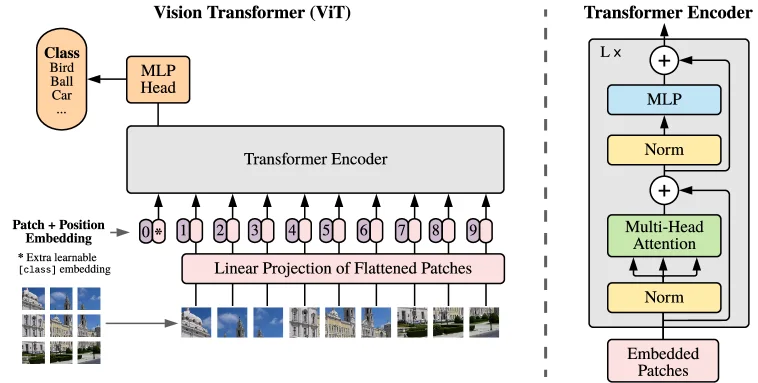
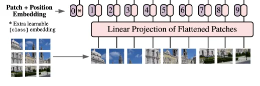
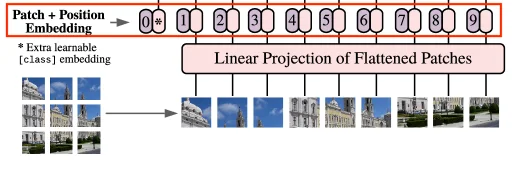

> ViT（Vision Transformer）直接把图像视为一串序列，把 Transformer 结构引入了视觉任务。
>
> 这是 Transformer 走向**跨模态大一统**的标志性起点。

## 序列转换

在 CNN 中，图像天然是一张二维网格。卷积核在这张网格上滑动，局部感受野叠加，模型从边缘纹理走向高级语义。

Transformer 无法直接处理二维网格，它的标准输入格式是一维的 Token 序列：

$$
X = (x_1, x_2, ..., x_N)
$$

ViT 解决输入格式差异的方法是 **Patchify（图像分块）**。

假设输入图像的维度是 $H \times W \times C$（高、宽、通道数），设定的 Patch 边长是 $P$。ViT 会将整张图像切分为互不重叠的图块。

切分后的 Patch 数量（即序列长度）为：

$$
N = \frac{H \times W}{P^2}
$$

每个图块本身包含 $P \times P \times C$ 个像素值。将其展平为一个一维向量后，需要通过一个线性投影层，将其映射到 Transformer 统一的隐藏层维度 $D$：

$$
x_p \in \mathbb{R}^{P^2 C} \to z_p \in \mathbb{R}^{D}
$$

至此，一张图像完成了从二维像素网格到长度为 $N$、维度为 $D$ 的 Token 序列的转换。

## 块级词元

如果不做 Patchify，而是把图像的每个像素直接视为一个 Token，计算代价是无法承受的。

以一张 $224 \times 224$ 的 RGB 图像为例，逐像素输入的序列长度为：

$$
N = 224 \times 224 = 50176
$$

Transformer 中 Self-Attention 的时间与空间复杂度均为 $O(N^2)$。长度超过 5 万的序列会导致显存直接溢出。

采用论文中经典的 $16 \times 16$ 尺寸（即 ViT-B/16），序列长度缩减为：

$$
N = \frac{224 \times 224}{16^2} = 196
$$

196 的序列长度对 Transformer 而言处于极高效率的计算区间内。

在代码实现层面，Patch Embedding 的展平与线性投影操作，完全等价于一个大步长的二维卷积：

$$
\text{Conv2D}(in\_channels=C, out\_channels=D, kernel\_size=P, stride=P)
$$

> 眼不眼熟，这跟我们之前在[棋盘效应](/blog/cnn-06-unet/#解码-decoder)分析里的等价推导异曲同工。

这里使用卷积并非为了引入 CNN 的局部先验，仅仅是工程上利用成熟算子高效实现**非重叠滑动切块与维度映射**。

## 位置编码

Self-Attention 机制具有排列不变性，它本身无法感知序列元素的先后位置。图像切分成块后，如果不提供空间信息，模型将无法区分相邻和相距甚远的图块。

ViT 为每个 Patch Token 显式注入位置编码：

$$
z_0 = [x_{\text{class}}; x_p^1E; x_p^2E; ...; x_p^NE] + E_{\text{pos}}
$$

公式拆解：

- $x_p^i$：第 $i$ 个图块展平后的原始向量。
- $E$：Patch Embedding 的线性投影矩阵，维度为 $(P^2C) \times D$。
- $x_p^iE$：经过投影后的第 $i$ 个 Patch Token。
- $x_{\text{class}}$：额外追加在序列开头的分类标记（Class Token），维度为 $D$。
- $E_{\text{pos}}$：可学习的一维位置编码矩阵，维度为 $(N+1) \times D$。它与拼接后的 Token 序列直接相加。

位置编码的作用是让 Transformer 在进行全局 Attention 计算时，能够感知当前 Token 在原图像中的具体物理坐标。

## 分类标记

ViT 在所有 Patch Token 的最前端插入了一个特殊的分类标记（Class Token）。这种设计直接沿用了 [BERT](/blog/llm-02-bert/) 处理文本分类任务的范式。

Class Token 初始化时仅是一个随机的可学习向量，不包含任何具体图像像素信息。经过多层 Transformer 结构的 Self-Attention 交互后，它会不断从各个位置的 Patch 中聚合全局信息。

最终的分类头只需要读取最后一层的 Class Token 输出进行判别：

$$
y = \text{MLN}(\text{LN}(z_L^0))
$$

公式拆解：

- $z_L^0$：第 $L$ 层（最后一层）Transformer 输出序列中，索引为 0 的向量，即更新完毕的 Class Token。
- $\text{LN}$：Layer Normalization 操作。
- $\text{MLP}$：多层感知机（分类头），输出维度对应分类类别的数量。
- $y$：最终的预测概率分布。

Class Token 是一个信息汇聚点，Patch 负责携带原始局部视觉特征，Class Token 负责收敛全图上下文并做出决策。

## 编码器

完成前端的 Patch 转换、位置编码和标记插入后，ViT 内部的主干网络完全照搬了标准的 Transformer Encoder 结构，未做任何视觉特化修改。

其核心前向传播过程如下：

$$
z'_l = \text{MSA}(\text{LN}(z_{l-1})) + z_{l-1}
$$

$$
z_l = \text{MLP}(\text{LN}(z'_l)) + z'_l
$$

公式拆解：

- $z_{l-1}$：上一层的输出序列。
- $\text{LN}$：前置的层归一化。
- $\text{MSA}$：多头自注意力机制（Multi-Head Self-Attention），负责所有图块间的全局信息交互。
- $\text{MLP}$：包含非线性激活函数的多层感知机，负责单个图块特征的维度变换与特征提取。
- 两个式子末尾的加法均为残差连接（Residual Connection），用于缓解梯度消失。

NLP 处理词元片段，ViT 处理图像图块。Self-Attention 的本质是**计算向量序列的相关性并完成信息聚合**，它不关心底层数据模态。只要输入被标准化为统一的 Token，计算逻辑就完全一致。

## 归纳偏置

CNN 的统治力建立在强烈的视觉归纳偏置（Inductive Bias）之上：

1. **局部性**：图像中相邻的像素相关性更高。
2. **平移等变性**：相同的特征（如猫的耳朵）无论出现在图像哪个位置，卷积核都能通过权值共享识别它。

ViT 抛弃了这些人工设计的先验假设。Self-Attention 默认所有 Patch 之间都有连接，让模型自己从零开始去学习谁和谁有关。

这种架构设计的代价是**极度的数据饥渴**。在 ImageNet 这种百万级中等规模数据集上，ViT 缺乏先验的劣势会导致其泛化能力不如同级别的 CNN（如 ResNet）。

但优势在于**上限极高的扩展性（Scalability）**。当预训练数据量达到千万甚至亿级别（如 JFT-300M）时，Transformer 纯粹的矩阵运算和更少的假设限制，使其性能天花板远超 CNN。

## 范式转移

ViT 并没有宣判 CNN 在所有场景的死刑，**边缘计算和数据受限任务**依然是 CNN 的主场。

ViT 的核心价值在于完成了视觉底座的范式转移：从“依靠人工先验设计局部结构”转向“依靠大规模数据学习全局关系”。

它证明了：视觉任务不需要被困在卷积的框架里。只要解决“如何将信号 Token 化”的问题，Transformer 就能成为跨越 NLP、CV 乃至更多模态的通用架构。后续的视觉语言大模型（VLM）以及将扩散模型骨架替换为 Transformer 的 [DiT](/blog/diffusion-04-dit/)，其底层逻辑全部建立在 ViT 铺设的这条道路上。

## 参考资料

- ViT 论文：[An Image is Worth 16x16 Words: Transformers for Image Recognition at Scale](https://arxiv.org/abs/2010.11929)
- Jay Alammar 的 [The Illustrated Transformer](https://jalammar.github.io/illustrated-transformer/)
